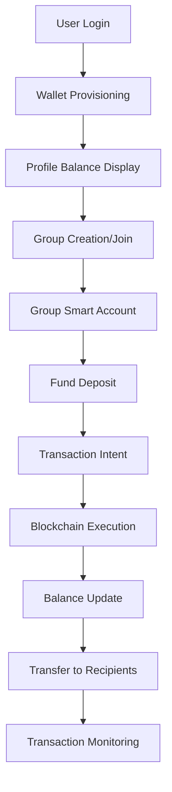

# Openfort Blockchain Integration - Product Requirements Document

## 1. Product Overview

The Roomy application integrates Openfort's wallet infrastructure to provide seamless blockchain functionality for expense sharing and group financial management. Users can create embedded wallets, manage group smart accounts, and perform on-chain transactions without complex Web3 knowledge.

The system enables users to deposit funds into group smart accounts, track balances in real-time, and transfer funds to recipients using Ethereum Sepolia testnet (Chain ID: 11155111). This integration eliminates the need for users to manage private keys while maintaining non-custodial wallet security.

## 2. Core Features

### 2.1 User Roles

| Role | Registration Method | Core Permissions |
|------|---------------------|------------------|
| Regular User | Email/password registration | Create/join groups, view balances, initiate deposits |
| Group Admin | Promoted by existing admin | All user permissions + manage group settings, approve transfers |
| System Admin | Internal promotion | Full system access, user management, system monitoring |

### 2.2 Feature Module

Our blockchain integration consists of the following main components:

1. **User Wallet Management**: Automatic wallet provisioning, balance tracking, transaction history
2. **Group Smart Accounts**: Shared wallet creation, multi-user fund management, balance aggregation
3. **Transaction Processing**: Deposit handling, transfer execution, intent monitoring
4. **Balance Synchronization**: Real-time balance updates, cross-chain compatibility
5. **Profile Integration**: Wallet balance display, transaction history, account management

### 2.3 Page Details

| Page Name | Module Name | Feature Description |
|-----------|-------------|---------------------|
| User Profile | Wallet Balance Display | Show real-time wallet balance from blockchain, display wallet address, transaction history |
| User Profile | Wallet Provisioning | Automatically create Openfort embedded wallet on first login, store wallet credentials securely |
| Group Dashboard | Smart Account Management | Display group smart account address, show aggregated balance, list recent transactions |
| Group Dashboard | Fund Addition Interface | Allow users to deposit ETH/USDC to group account, create Openfort transaction intents |
| Transaction Page | Transfer Execution | Send funds from group address to recipients, validate addresses, track transaction status |
| Transaction Page | Intent Monitoring | Real-time transaction status updates, blockchain confirmation tracking |
| Settings Page | Wallet Configuration | View wallet details, export options, security settings |

## 3. Core Process

### User Wallet Flow
1. User registers/logs in → System automatically provisions Openfort embedded wallet
2. User views profile → Real-time balance fetched from blockchain via RPC
3. User joins group → Wallet address linked to group membership

### Group Smart Account Flow
1. Admin creates group → System provisions group smart account via Openfort
2. Members deposit funds → Transaction intents created and executed on-chain
3. Group balance updated → Real-time synchronization with blockchain state

### Transfer Flow
1. User initiates transfer → Validate recipient address and amount
2. Create transaction intent → Openfort processes the blockchain transaction
3. Monitor completion → Real-time status updates until confirmation

## 4. User Interface Design

### 4.1 Design Style

- **Primary Colors**: #2563eb (blue-600), #1e40af (blue-700)
- **Secondary Colors**: #10b981 (emerald-500), #f59e0b (amber-500)
- **Button Style**: Rounded corners (8px), gradient backgrounds, hover animations
- **Font**: Inter, system-ui fallbacks, 14px base size
- **Layout Style**: Card-based design, clean spacing, mobile-first responsive
- **Icons**: Heroicons for consistency, cryptocurrency symbols for tokens

### 4.2 Page Design Overview

| Page Name | Module Name | UI Elements |
|-----------|-------------|-------------|
| User Profile | Wallet Balance | Large balance display with ETH symbol, gradient card background, refresh button |
| User Profile | Wallet Address | Copyable address field, QR code option, truncated display with tooltip |
| Group Dashboard | Smart Account | Prominent balance card, member contribution breakdown, deposit CTA button |
| Transaction Page | Transfer Form | Amount input with currency selector, recipient address validation, gas estimation |
| Transaction Page | Status Tracking | Progress indicator, transaction hash link, estimated completion time |

### 4.3 Responsiveness

Desktop-first design with mobile-adaptive layouts. Touch-optimized buttons and inputs for mobile devices. Responsive balance displays and transaction forms across all screen sizes.

## 5. Technical Requirements

### 5.1 Blockchain Integration

- **Network**: Ethereum Sepolia Testnet (Chain ID: 11155111)
- **Wallet Provider**: Openfort embedded wallets with account abstraction
- **Supported Tokens**: Native ETH, USDC (ERC-20)
- **RPC Provider**: Sepolia public RPC with fallback options

### 5.2 Security Requirements

- Non-custodial wallet architecture with Openfort key management
- Secure API key storage and rotation
- Transaction validation and amount limits
- Address validation and checksum verification

### 5.3 Performance Requirements

- Balance updates within 3 seconds of blockchain confirmation
- Transaction intent creation under 1 second
- Real-time status updates via polling/webhooks
- 99.9% uptime for wallet operations

## 6. API Integration Points

### 6.1 Openfort API Endpoints

- `POST /v1/players` - Create user players
- `POST /v1/accounts` - Provision embedded wallets
- `POST /v1/transaction_intents` - Create blockchain transactions
- `GET /v1/transaction_intents/{id}` - Monitor transaction status

### 6.2 Internal API Requirements

- User wallet provisioning endpoint
- Group smart account creation
- Balance synchronization service
- Transaction monitoring system

## 7. Data Requirements

### 7.1 User Wallet Data

- Openfort player ID and account ID
- Wallet address and chain ID
- Current balance (cached with TTL)
- Transaction history and metadata

### 7.2 Group Smart Account Data

- Group-linked smart account address
- Member contribution tracking
- Transaction intent IDs and status
- Balance aggregation across members

## 8. Success Metrics

- 100% successful wallet provisioning on user registration
- <5 second average transaction intent creation time
- 99% transaction success rate for valid operations
- Real-time balance accuracy within 1 block confirmation
- Zero private key exposure or security incidents